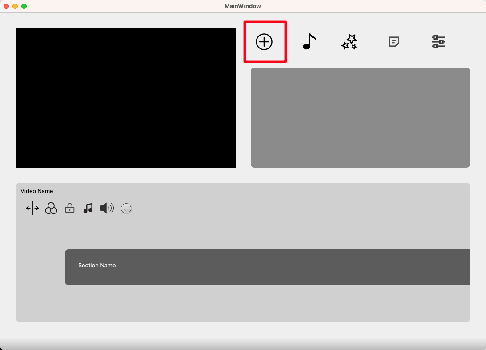

## 1. Run

### 1.1 Click the run button

### 1.2 Click the Play button to import videos

### 1.3  The video player can run successfully

## 2. Functions

We totally designed 3 pages and each one has its own functions. All the pages of the Player are responsible.

### 2.1 Home Page

Home page is the main page for users to warch videos and enter the other pages, it has several main functions as follows.

#### 2.1.1 Control bar

The control bar can control the video play mode, which has specfic functions as follows:

Play progress setting, screen shot, double speed, backward and foreward 3s, last and next video, stop and continue, volume setting, play sequence setting and full screen setting. All the functionals in the control are implemented.

And in full screen mode, the control can rendered successfully and has the same functions as uppons.

#### 2.1.2 Category

The videos can be category into two categoties, the users can right cilck the viedo in scoll area and set the categories.

After setting the category, users can check the videos in one category by clicking the buttons uppon the scroll area.

#### 2.1.3 Search

A search bar is designed on the homepage, the users can search the video they want. However, the search logic has not been implemented. 

### 2.2 Editor page

User can click the ``Edit`` button in the homepage to open the editor page. In editor page, users also can choose the video they want by click the ``+`` button.

Below the video window, the progress bar of the video is shown in apparent way. And there are several functional buttons of the video editor. However, the funcations of these buttons have not been implemented yet.

## 2.3 User Profile Page

We also designed the user profile page, which can be open by click the ``username`` button in homepage. Users can check the profile information of his account. The functions of this page have not been implemented.

## 3. Development Progress

We totally have 5 iterations in the developmenr progress. The Hang Sun, Xiaokang Ye and Pengchen Chen are mainly response for the codind, Yuan Xuwu and Junzhe Wang are mainly response for the report writing. The main timetable are shown as follows:

| Date  |    Member     |                             Work                             |
| :---: | :-----------: | :----------------------------------------------------------: |
| 11.28 |   Hang Sun    | The function of clicking button to add files and clicking button to pause and play and a very basic UI struction. |
| 11.29 |   Hang Sun    | Resturcture the file, and make it easy to collabrate and a more complex UI with QT design. |
| 12.01 |   Hang Sun    |                    Click the mute button                     |
| 12.01 | Pengchen Chen |                  VideoWidget Part Completed                  |
| 12.01 |   Wuyuan Xu   |                         Full Screen                          |
| 12.01 |  Xiaokang Ye  | Double Speed, Backward & Forward, Keyboard Controllor，UI Full Screen |
| 12.02 |   Hang Sun    | Set gitignore, video progress bar, function of clicking next and video tittle |
| 12.11 |   Hang Sun    |               Set a new UI but not responsive                |
| 12.12 |   Hang Sun    |     Responsive and fuction of change mode and screenshot     |
| 12.14 |  Xiaokang Ye  | Fix the bugs: mute button, scroll area; feat: add the controll bar show up automatically |
| 12.14 | Pengchen Chen |      add function: right-click to display the minimenu       |
| 12.18 |   Hang Sun    |              A New window of editting and class              |
| 12.18 | Pengchen Chen |    Reformat the video play layout, edit the zoom function    |
| 12.19 | Pengchen Chen |           Fix the bug about the title of the video           |
| 12.19 |  Xiaokang Ye  |                        Add categories                        |
| 12.19 |   Hang Sun    |                            New UI                            |
| 12.19 | Pengchen Chen |             Small changes of video controlbar UI             |
| 12.21 |  Xiaokang Ye  |   Editor page import videos, fix homepage scrollarea bugs    |
| 12.22 |  Xiaokang Ye  |          pref whole window, fix the categoies bugs           |
| 12.22 |   Hang Sun    |                    New User UI and search                    |

